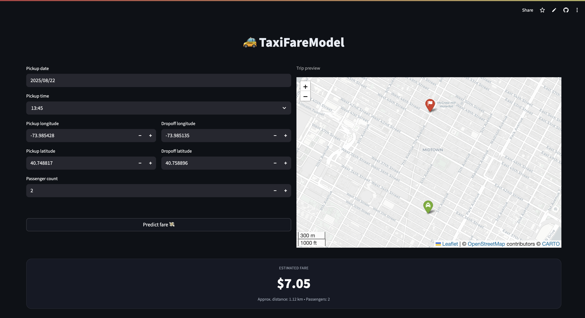

# 🚕 TaxiFareModel Frontend

This project was built during the **Le Wagon Data Science & Machine Learning Bootcamp**.
We trained a **Machine Learning model** to predict taxi fares in New York City, exposed it through an API, and this Streamlit app is our **first deployment** calling that API in real time. 🎉

---

## ✨ Features
- 📅 Input pickup **date & time**
- 📍 Select pickup & dropoff **coordinates**
- 👥 Choose **number of passengers**
- 🌍 Interactive **map preview** (OpenStreetMap + Folium)
- ⚡ Live fare predictions from our **TaxiFare API**

---

## 📸 Preview


---

## 🚀 Live Demo
👉 [TaxiFareModel on Streamlit](https://taxifare-website-chrvapppjuozf3hpmtoto7c.streamlit.app/)

---

## 🛠 Tech Stack
- [Streamlit](https://streamlit.io/) – frontend framework
- [Folium](https://python-visualization.github.io/folium/) + [streamlit-folium](https://github.com/randyzwitch/streamlit-folium) – map visualization
- [Requests](https://docs.python-requests.org/) – API calls
- [OpenStreetMap](https://www.openstreetmap.org/) – free map tiles
- **ML Model** – trained during the bootcamp for NYC taxi fare prediction

---

## ⚙️ Setup

### Git clone the project
```bash
git clone https://github.com/Marxi7/taxifare-website.git
cd taxifare-website
```

### Install dependencies
```bash
pip install -r requirements.txt
```

### Run the app
```bash
streamlit run app.py
```

### 👤 Stay in Touch
📌 First deployed ML project from the Le Wagon Bootcamp
✍️ Author - [Marcello](https://github.com/Marxi7)
